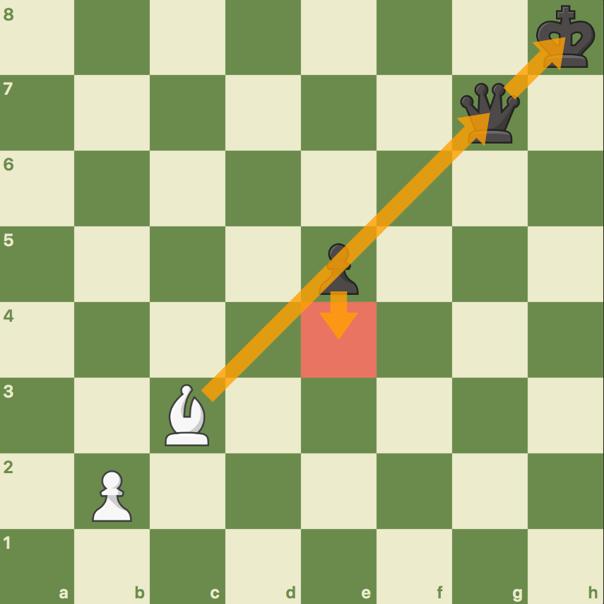

<h1> Pin Detection </h1>

Finds new pins that arise following a made move in a given position.

<h3> Requirements </h3>

- python3.8
- [python-chess](https://python-chess.readthedocs.io/en/latest/index.html)

<h3> Setup </h3>

```
$ git clone https://github.com/perintyler/pin_detection
$ cd pin_detection
$ pip install -r requirements.txt
```

<h3> Usage </h3>

In order to detect pins,

Using the command line interface:
```
$ python cli.py "7k/6q1/8/8/8/8/8/1KB5 w - - 0 1" "c1b2"
The bishop on b2 is pinning the queen on g7 to the king on h8.
```

Using the detect_pin function:
```
from pin import detect_pins

>>> position = '7k/6q1/8/8/8/8/8/1KB5 w - - 0 1' # FEN
>>> move = 'c1b2'  # UCI
>>> pins = detect_pins(position, move):
>>> for pin in pins:
>>>   print(pin) # can also access pieces in the e.g. 'pin.attacker'
The bishop on b2 is pinning the queen on g7 to the king on h8.
```


<h1> Current Solution </h1>

1. Find pin candidates for created, discovered, and replacement pins
2. Use the 'peekaboo algorithm' (see 'Checking attacks for Pins' below) to
   give a candidate  temporary sight into the blind spot behind the enemy piece.
3. If the 'peek' gives the candidate vision on a new enemy piece behind the other,
   a pin has been detected.
4. Filter out pins that aren't significant (using material value)

<h3> Pin Candidates </h3>

The first step of pin detection is finding all pin candidate. Pin candidate
are pieces that gain an attack on an enemy piece following a made move.
Pin candidates can only be sliding pieces -- so only rooks, bishops, and queens.
Each new attack on an enemy piece has the potential to create a pin and
therefore must be searched.

I've defined 3 types of pins: created, discovered, and replacement

<h4> Created Pin </h4>
When a piece moves to a new square, gaining a new attack on an enemy piece,
which gets pinned. The only candidate for a created pin is the moving piece.

<p align="center">
  
</p>

<h4> Discovered Pin </h4>
the attacker of a discovered pin can be either color, since
  after the move is made, any piece with vision on the original square of the
  moving piece will be able to 'see' the previously obstructed 'blind spot'
  (behind where the moving piece was). Therefore, any sliding piece that can
  see the moving piece pre-move is a pin candidate, since the added vision may
  open up a new attack on an enemy piece.

<p align="center">
  
</p>


<h4> Replacement Pin </h4>

A replacement pin is similar to a discovered pin, but only results when a pin
already exists. A replacement pin occurs when a shielded piece in a pin
moves, revealing another piece of the same color behind it. That piece, which
is located on the same ray as the pin and was previously out of the line of
sight of the attacking piece, now becomes the shielded piece. The attacker in a
replacement pin can only be the non-moving color.

<p align="center">
  
</p>


<h3> Checking attacks for Pins </h3>
A candidate's attack will cause a pin if the attacked enemy blocks the candidate
from being able to 'see' another enemy piece behind it. To determine if an attack
is a pin, I use what I call the 'peekaboo algorithm' which temporarily removes the
enemy piece, allowing the candidate to see behind the enemy, before finally
putting the piece back and re-blocking its sight. Now you see me. Now you don't.

<h1> New Solution </h1>

Since performance isn't a priority, instead of using the potential pin
candidate method, which doesn't work for replacement pins, new pins can
be detected by checking each sliding piece's attacks for pins before the move.
Then, the process is repeated for the position following the move. By  comparing
the pins pre and post move, the new pins can be identified. This way,
correctness is ensured. Fortunately, I can still use the same 'peekaboo algo' to
check attacks for pins (see peek_behind_enemy_for_pin in pin.py). This is a clean
and simple solution, and as long as performance is adequate, I believe it to be
the best approach.


<h2> Notes </h2>

- when using peek_behind_enemy_for_pin to find discovered pins, the same
  attack set is computed a bunch of times (once for every pin candidate).
  I could fix it at the cost of a loss of readability/clarity to achieve
  a performance trade off. Realistically, idt it matters.
- Even if a shielded piece has less material value than its defender, if the
  shielded piece is hanging, the pin is valuable because the defender can't move.
- detecting situational pins, such as a piece pinned to a mate threat, would be
  really cool.
